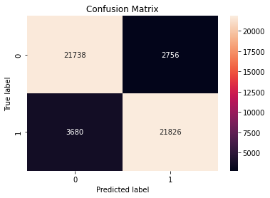

# sentiment-analysis

## Introduction
Stock markets are one of the long-term financial instruments traded in the capital market. Shares can be defined as a sign of participation or ownership of a person or business entity in a company or limited liability company. A piece of paper containing proof of ownership of the company that issued the securities is a form of shares. The position of demand and supply for shares in the capital market, making shares have a price to be traded. The higher the level of demand and supply for shares, the higher the share price and vice versa.

## Analysis Purpose
This research aims to show the public that public sentiment about the condition of a company's stock can affect the company's potential to increase or decrease in stock value. In addition, this research also aims to find companies that have the potential to experience an increase in stock value as a stock purchase recommendation for investors.

## Dataset
In the study, the data used is data in the form of financial conditions of six companies from 2019 to December 2, 2022. The financial data of the companies used comes from the following companies:
- Tesla (TSLA), which is an automotive company that focuses on selling electric cars.
- Apple (AAPL), which is a company engaged in technology and is commonly known for its product called iphone.
- Amazon (AMZN), which is a company engaged in various different fields, such as e-commerce, cloud computing, and digital movie streaming.
- Nvidia (NVDA), which is a company engaged in technology with products in the form of Graphics Processing Units (GPUs).
- Microsoft (MSFT), a company engaged in various technology sectors, such as operating systems, licensing products and services, cloud computing, and others.
- Meta (META), also known as Facebook, is a company engaged in social media with social media application products such as Instagram, Facebook, Whatsapp, and a Virtual Reality project known as Metaverse.

The financial data is retrieved manually through the data scraping method using the python programming language. The data was obtained using the yfinance library through the Ticker function and displayed in graph form using the graph_objects function derived from the plotly library and obtained 4,542 pieces of data with 757 pieces of data each in one company.

In addition to data on the company's financial condition, the project also uses data in the form of tweets about the six companies from November 3, 2019 to December 2, 2022 obtained using the data scraping method using the snscrape.module.twitter library. The total data used is 90,000 tweets which are divided into 15,000 tweets in each company.

## Methodology
The sentiment analysis project was created using the Python programming language and Google Collaboratory as a tool to run the programming language. The analysis began by downloading (installing) several additional libraries, such as yfinance to retrieve data in the form of stock conditions in real time, snscrape to retrieve datasets in the form of tweets, and sklearn to create the sentiment analysis model. 

After importing the functions to be used, the process continues by determining 6 companies to be analyzed, namely Tesla, Apple, Amazon, Nvidia, Microsoft, and Meta. Each company will take stock conditions from 2019 to 2022 with the company_ticker.history function. After obtaining the stock data, the data is displayed in a graph using the figure function from the graph_object library. Based on the graph, we perform explanatory data analytics (EDA) to see the good and bad condition of each company's shares for the last 3 years. 

After explanatory data analytics, the process continues by processing data obtained from kaggle in the form of amazon reviews totaling 50000 testing data and 50000 training data. The data is processed with functions from the NLTK library by removing some punctuation marks such as periods and removing affixes. This process is done before entering the model creation process.

In the model creation process, we create a model using a supervised learning approach (Naive Bayes), which is suitable for text classification tasks where the goal is to predict a label (e.g., positive or negative sentiment) based on the text. The reason for using the Naive Bayes method is that it is one of the popular algorithms used for text classification tasks, is relatively easy to implement, and can often achieve good performance. The Multinomial Naive Bayes algorithm is implemented using functions from the scikit-learn library to classify reviews as positive or negative based on their text. This is done by first converting the text into numerical features using the CountVectorizer, then training the model using the training data, and finally making predictions on the testing data.

After training and testing the model, the prediction results of the model are evaluated in the form of a confusion matrix and display the accuracy, precision, f1-score, and recall of the model.
	Based on the results that have been obtained, we evaluate whether the accuracy value that has been obtained has reached the level set as the minimum standard, which is 85%. As a result, the model we have created has reached the minimum standard with an accuracy value of 87.128% with the confusion matrix results as follows.

 
